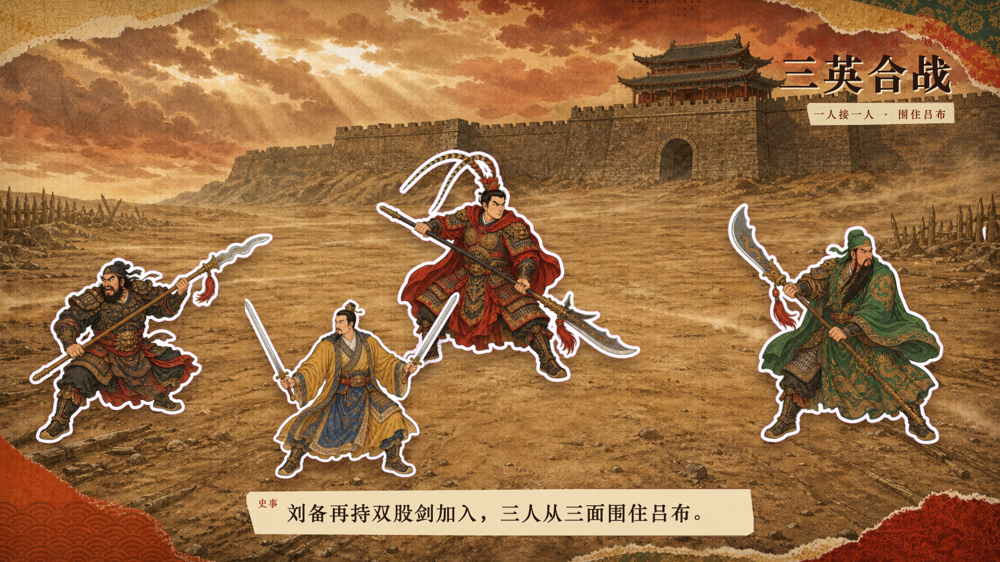

# Paper Collage Story Video

把一个历史、人物或文化主题，制作成带叙事字幕的中国纸片剪贴动画。

这个仓库包含可安装的 Codex Skill、数据驱动的 Remotion 模板，以及《三英战吕布》完整示例。默认输出无音频、三幕、带六段解释字幕的短视频。



## 特点

- 先写故事字幕，再让画面服务字幕。
- 每幕生成一张空场景底图和一张贴纸素材表。
- 人物、动物、船只和道具拆成完整独立 PNG。
- 普通贴纸逐张进入；只有对称元素可以成对进入。
- 标题和字幕使用压印式纸张动画。
- 支持从 Codex 会话 JSONL 恢复 ImageGen base64 图片。
- 支持绿色与洋红色键色，避免误抠绿色人物或道具。
- 自动校验场景、字幕、素材路径与贴纸入场节奏。

## 安装 Skill

```bash
git clone https://github.com/Mr-funny/paper-collage-story-video.git
cp -R paper-collage-story-video/skills/paper-collage-story-video ~/.codex/skills/
```

在新的 Codex 任务中使用：

```text
使用 $paper-collage-story-video，把“郑和下西洋”制作成一条带故事字幕的无音频纸片剪贴动画。
```

## 创建新项目

```bash
python3 skills/paper-collage-story-video/scripts/new_project.py \
  --output /absolute/path/to/my-story \
  --name my-story-video

cd /absolute/path/to/my-story
pnpm install
```

随后生成背景与贴纸素材，编辑：

- `public/story/story.json`：场景、贴纸位置与入场帧。
- `public/story/captions.json`：Remotion Caption JSON 字幕。
- `ASSET_PROMPTS.md`：实际使用的图片提示词。

校验和渲染：

```bash
python3 /path/to/skill/scripts/validate_story.py .
pnpm run lint
pnpm run stills
pnpm run render
```

## 贴纸素材处理

从 Codex 会话恢复图片：

```bash
python3 skills/paper-collage-story-video/scripts/recover_imagegen.py \
  /path/to/session.jsonl /path/to/raw-assets --last 6
```

拆分严格 2×2 洋红贴纸表：

```bash
python3 skills/paper-collage-story-video/scripts/prepare_stickers.py \
  sheet.png output-dir \
  --rows 2 --cols 2 \
  --names lubu,zhangfei,guanyu,liubei \
  --key-color ff00ff
```

脚本需要系统 `ffmpeg`，也可以通过 `--ffmpeg /absolute/path/to/ffmpeg` 指定。

## 示例

`examples/three-heroes-vs-lu-bu` 是一个 15 秒、1920×1080、30fps 的可运行项目，包含三幕、六段字幕和十二张独立贴纸。《三英战吕布》按《三国演义》的文学故事表达，并非正史事件。

仓库不提交渲染 MP4、`node_modules`、Codex 会话文件或原始贴纸表。进入示例目录运行 `pnpm install && pnpm run render` 即可生成成片。

## 目录

```text
skills/paper-collage-story-video/   Codex Skill、脚本和 Remotion 模板
examples/three-heroes-vs-lu-bu/    完整故事示例与最终素材
```

示例插画由 OpenAI ImageGen 生成。代码与 Skill 采用 MIT License。
