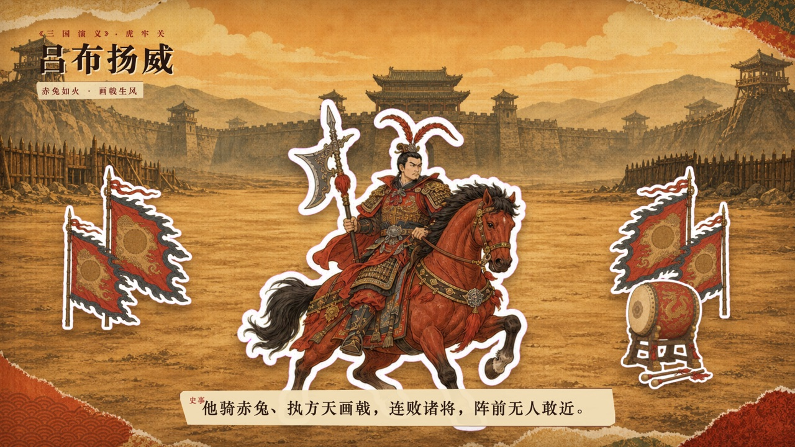
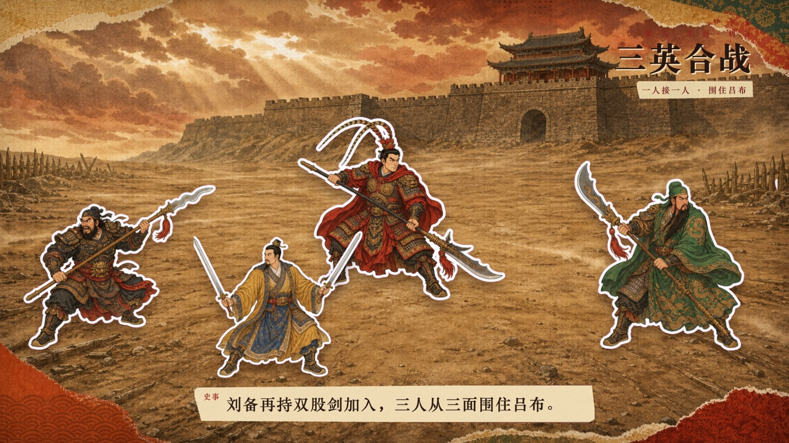
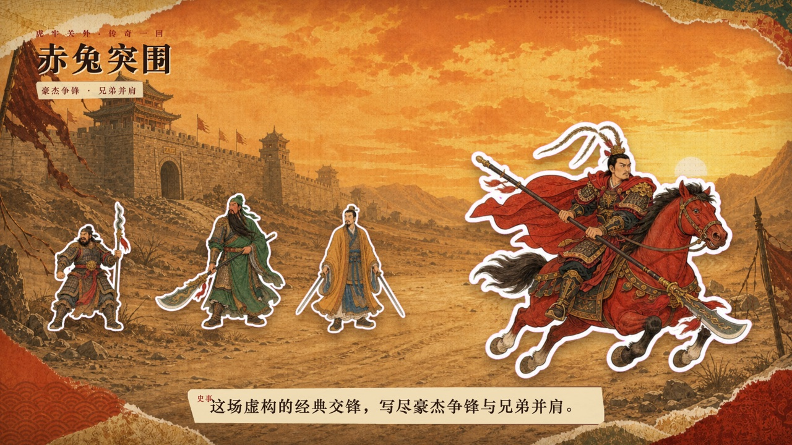
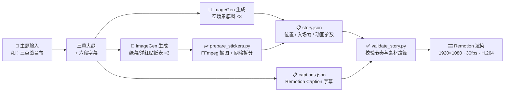
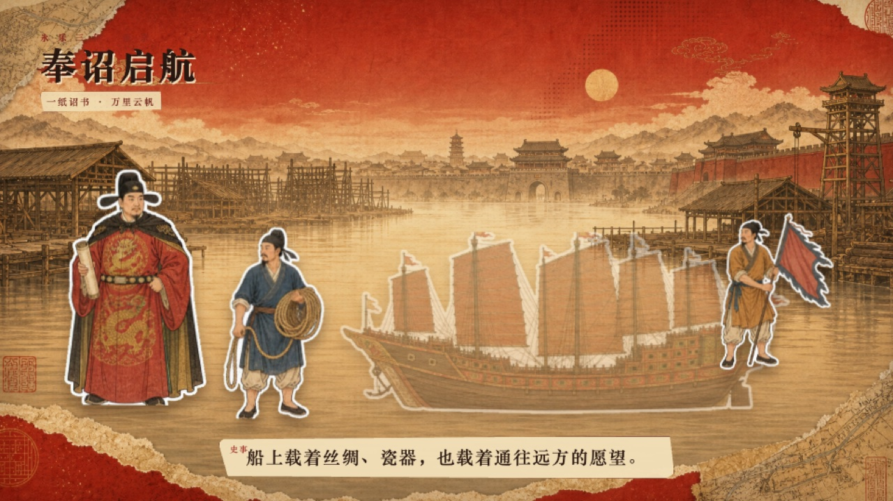
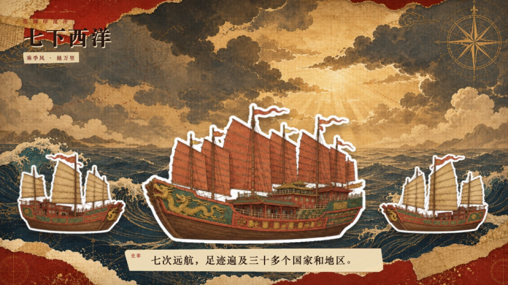
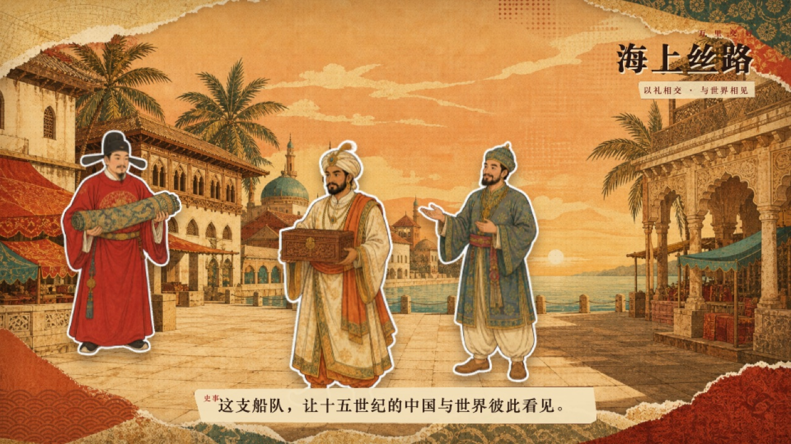
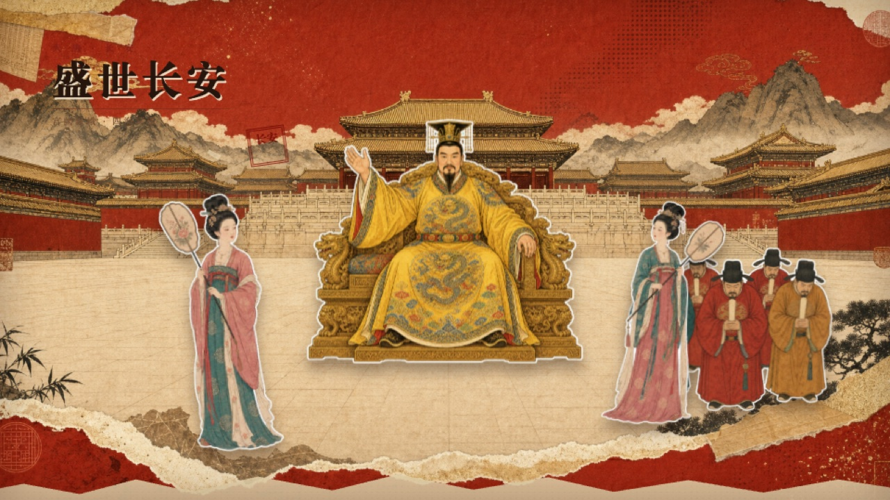
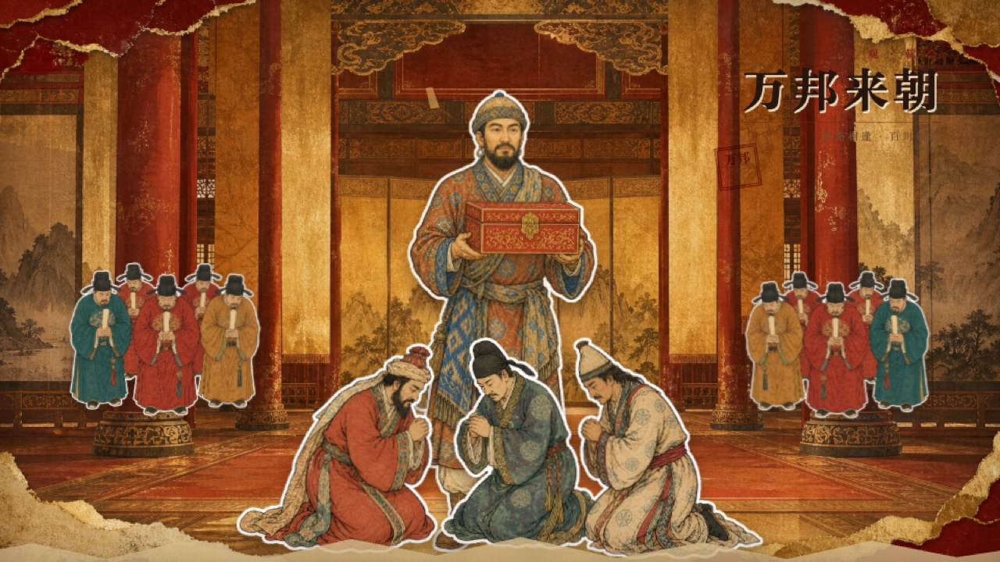

# 📜 Paper Collage Story Video · 纸片剪贴故事视频

> 把一个历史事件、人物传记或文化主题，一句话变成带叙事字幕的中国纸片剪贴动画。

<p align="center">
  
</p>

<p align="center">
  <a href="LICENSE"></a>
  
  
  
  
</p>

这是一个可安装的 **Agent Skill**（标准 `SKILL.md` 格式，兼容 Codex / Claude Code 等支持 Agent Skills 的工具），附带数据驱动的 **Remotion 视频模板**和《三英战吕布》完整可运行示例。

你只需要给 AI 一个主题，它会：写三幕故事和六段字幕 → 生成空场景底图和贴纸素材表 → 自动抠图拆分成独立贴纸 → 按字幕节奏编排入场动画 → 渲染出 1920×1080 无音频 MP4。

## 🎬 演示视频

<!-- 👇 在 GitHub 网页编辑器中把 MP4 拖拽到这一行下方，会自动生成视频链接 -->

*演示视频即将上传。*

## ✨ 效果预览

| 第一幕 · 吕布扬威 | 第二幕 · 三英合击 | 第三幕 · 吕布败走 |
| :---: | :---: | :---: |
|  |  |  |

## 🧠 工作原理

核心理念：**先写故事，再让画面服务字幕**。每一个贴纸的入场，都对应一句正在播放的字幕。



拆开看每一步：

1. **故事先行** — AI 先写出三幕大纲和六段中文解释字幕，每段字幕承担一个明确的叙事任务，之后所有画面都为字幕服务。
2. **底图与贴纸分离** — 每幕生成一张**没有任何人物和道具**的空场景底图，以及一张**纯绿色（`#00ff00`）或洋红色（`#ff00ff`）背景**的贴纸素材表。素材表上每个对象完整独立、互不接触、带白色贴纸描边。
3. **自动抠图拆分** — `prepare_stickers.py` 只依赖 FFmpeg，按提示词中约定的严格网格（如 2×2）把素材表抠掉键色并切成独立透明 PNG。重要角色是绿色时自动改用洋红键色，避免把人抠没了。
4. **数据驱动编排** — 视频完全由两个 JSON 驱动，不用改一行 React 代码：
   - `story.json`：每幕的底图、标题、每张贴纸的位置、大小、入场帧和入场动画（滑入方向、缩放、飘浮幅度）。
   - `captions.json`：标准 Remotion Caption 格式的字幕时间轴。
5. **入场语义** — 普通贴纸必须逐张进入（不同 `entryFrame`）；只有真正对称的元素（如左右两面军旗）才允许同帧成对进入，且必须声明同一个 `entranceGroup`。标题和字幕使用压印式的缩放+透明度动画，而不是烂大街的滑入下三分之一条。
6. **先校验再渲染** — `validate_story.py` 检查场景时长、素材路径、贴纸入场节奏和字幕安全区，通过后再用 Remotion 渲染最终 MP4，并用 FFprobe 验证输出规格（无音轨、30fps、H.264）。

## 📦 安装

### Codex

```bash
git clone https://github.com/Mr-funny/paper-collage-story-video.git
cp -R paper-collage-story-video/skills/paper-collage-story-video ~/.codex/skills/
```

### Claude Code

```bash
git clone https://github.com/Mr-funny/paper-collage-story-video.git
cp -R paper-collage-story-video/skills/paper-collage-story-video ~/.claude/skills/
```

> Skill 中的图片生成步骤默认使用 Codex 内置 ImageGen；在其他环境下可以换成任意能输出纯色背景贴纸表的文生图工具，后续抠图、编排、渲染流程完全一致。

### 依赖

| 工具 | 用途 |
| --- | --- |
| Node.js 18+ / pnpm | 运行 Remotion 模板与渲染 |
| Python 3.9+ | 运行 4 个辅助脚本（仅标准库） |
| FFmpeg | 贴纸抠图与拆分 |

## 🚀 使用

安装后，在新任务里直接说：

```text
使用 $paper-collage-story-video，把"郑和下西洋"制作成一条带故事字幕的无音频纸片剪贴动画。
```

AI 会自动完成从故事、生图、抠图到渲染的全流程，默认产出 12 秒、1920×1080、30fps、三幕六字幕的无音频 MP4。

### 手动使用模板

也可以不经过 AI，直接把它当成一个 Remotion 纸片动画模板用：

```bash
# 1. 从模板创建新项目
python3 skills/paper-collage-story-video/scripts/new_project.py \
  --output /absolute/path/to/my-story --name my-story-video
cd /absolute/path/to/my-story && pnpm install

# 2. 把底图和贴纸 PNG 放进 public/assets/story/
#    编辑 public/story/story.json 和 public/story/captions.json

# 3. 校验、预览关键帧、渲染
python3 /path/to/skill/scripts/validate_story.py .
pnpm run lint
pnpm run stills
pnpm run render
```

### 贴纸素材处理

```bash
# 拆分一张严格 2×2 的洋红键色贴纸表
python3 skills/paper-collage-story-video/scripts/prepare_stickers.py \
  sheet.png output-dir \
  --rows 2 --cols 2 \
  --names lubu,zhangfei,guanyu,liubei \
  --key-color ff00ff

# 从 Codex 会话 JSONL 中恢复 ImageGen 生成的 PNG（不打印 base64）
python3 skills/paper-collage-story-video/scripts/recover_imagegen.py \
  /path/to/session.jsonl /path/to/raw-assets --last 6
```

## ⛵ 示例：郑和下西洋 & 唐朝纸片动画

[examples/tang-zhenghe-paper-animation](examples/tang-zhenghe-paper-animation) 是这套工作流的前身实验场——独立贴纸入场、压印式标题等规则都在这里打磨成型。一个项目包含三个合成：12 秒的《郑和下西洋》三幕故事、10 秒的唐朝双镜头动画（ImageGen 版和纯 SVG 版）。

| 龙江造船 | 扬帆远航 | 万国来朝 |
| :---: | :---: | :---: |
|  |  |  |

| 唐朝 · 盛世长安 | 唐朝 · 万邦来朝 |
| :---: | :---: |
|  |  |

```bash
cd examples/tang-zhenghe-paper-animation
pnpm install && pnpm run render:zhenghe
```

## 🗂️ 目录结构

```text
skills/paper-collage-story-video/
├── SKILL.md                       # Skill 入口：工作流与硬性构图规则
├── references/
│   ├── story-and-timing.md        # story.json / captions.json 的 schema 与节奏规范
│   └── image-prompts.md           # 底图与贴纸表的提示词模板
├── scripts/
│   ├── new_project.py             # 从模板复制新项目
│   ├── prepare_stickers.py        # FFmpeg 抠图 + 网格拆分独立贴纸
│   ├── recover_imagegen.py        # 从会话 JSONL 恢复 ImageGen 图片
│   └── validate_story.py          # 渲染前校验故事数据与素材
├── agents/openai.yaml             # Codex 界面元信息
└── assets/remotion-template/      # 数据驱动的 Remotion 项目模板

examples/three-heroes-vs-lu-bu/         # 《三英战吕布》数据驱动示例（Skill 标准产物）
examples/tang-zhenghe-paper-animation/  # 郑和下西洋 + 唐朝动画（工作流前身实验场）
```

## 🎭 示例：三英战吕布

`examples/three-heroes-vs-lu-bu` 是一个 15 秒、三幕、六段字幕、十二张独立贴纸的完整项目（题材取自《三国演义》文学故事，并非正史）。仓库不提交渲染产物和 `node_modules`，本地生成成片：

```bash
cd examples/three-heroes-vs-lu-bu
pnpm install && pnpm run render   # 输出 out/*.mp4
```

`ASSET_PROMPTS.md` 记录了示例中每一张图片实际使用的提示词，可以直接套用到自己的主题。

## 🧾 硬性构图规则（Skill 强制执行）

- ❌ 不允许把整张贴纸素材表放进成片，也不允许用 clip-path 切片代替真正的独立贴纸。
- ❌ 不允许两个无关贴纸同帧入场。
- ✅ 每个人物、动物、船只、道具、徽记都是一张独立透明 PNG。
- ✅ 字幕解释事件，贴纸入场演绎正在播放的那句字幕。
- ✅ 字幕节奏优先：读不完就加长视频或简化句子，而不是加快字幕。

## 📄 License

代码与 Skill 采用 [MIT License](LICENSE)。示例插画由 OpenAI ImageGen 生成。
